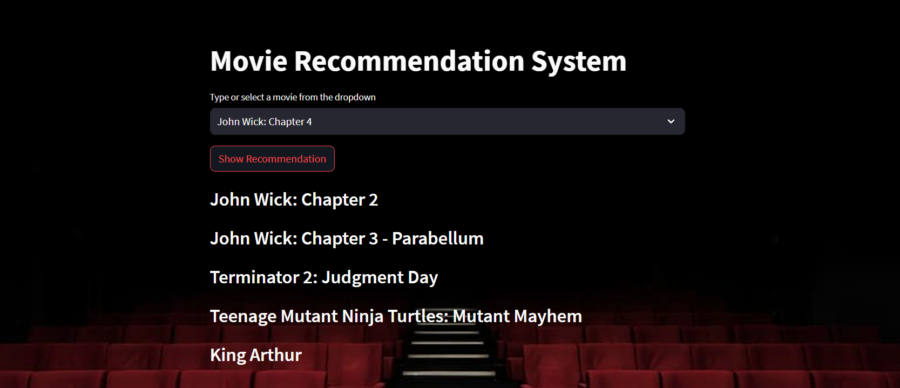

# Movie Recommendation System

This project focuses on building a movie recommendation system using a content-based approach, creating a user-friendly front-end web application to showcase the recommendations, and deploying the application using Docker and Google Kubernetes Engine.



## Project Summary

The project is divided into several key steps:

1. **Data Extraction using BeautifulSoup:**
   - We use the BeautifulSoup library to scrape movie data from the web. This data forms the basis for our recommendation system.

2. **Content-Based Recommendation System:**
   - Building upon the scraped data, we create a content-based recommendation system. This system suggests movies based on the content and features of the movies themselves, rather than relying on user preferences.

3. **Front-End Web App using Streamlit:**
   - To interact with our recommendation system, we design a front-end web application using Streamlit. Users can input their preferences, and the app will display relevant movie recommendations.

## Getting Started

Follow these steps to set up and run the Movie Recommendation System on your local machine:

1. Clone this repository:
   ```bash
   git clone https://github.com/botzaifa/Movie-Recommendation-System.git
   cd Movie-Recommendation-System
   ```

2. Create a 'dataset' folder in the root directory and place your dataset files there.

3. Run the data extraction script:
   ```bash
   python Data_Extraction.ipynb
   ```

4. Explore the dataset and perform feature engineering using EDA-Feature_Engineering.ipynb.

5. Build and run the Streamlit app locally:
   ```bash
   streamlit run frontend.py
   ```

For deployment instructions using Docker and Google Kubernetes Engine, please refer to the corresponding sections below.

## Dockerization

To containerize the application using Docker:

1. Install Docker on your machine.
2. Build the Docker image:
   ```bash
   docker build -t movie-recommendation-app .
   ```
3. Run the Docker container:
   ```bash
   docker run -p 8080:8080 movie-recommendation-app
   ```

## Deployment on Google Kubernetes Engine

To deploy the containerized app on Google Kubernetes Engine:

1. Set up your GKE cluster.
2. Deploy the Docker image to GKE:
   ```bash
   kubectl create deployment movie-recommendation-app --image=movie-recommendation-app
   ```
3. Expose the deployment as a service:
   ```bash
   kubectl expose deployment movie-recommendation-app --type=LoadBalancer --port=80 --target-port=8080
   ```

## Contributing

Contributions to this project are welcome! If you find any bugs or have ideas for improvements, feel free to open an issue or submit a pull request.

## License

This project is licensed under the [GNU General Public License v3.0](LICENSE).


# Created by: 
Me (Huzaifa Khan) here's my profile: [@botzaifa](https://github.com/botzaifa)


